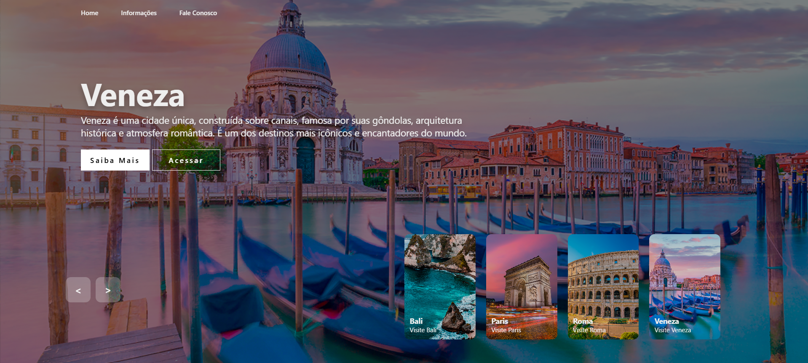

# 📸 Site Fotografia — Destinos pelo Mundo

Projeto de site institucional desenvolvido com **HTML, CSS e JavaScript**, focado em apresentar destinos turísticos de forma visual, moderna e interativa.  
O layout utiliza **slider/carrossel de imagens**, navegação intuitiva e uma experiência imersiva com destaque para fotografia e turismo.

🔗 **Acesse o site online:**  
👉 https://assisfilipee.github.io/Site-Fotografia/

---
